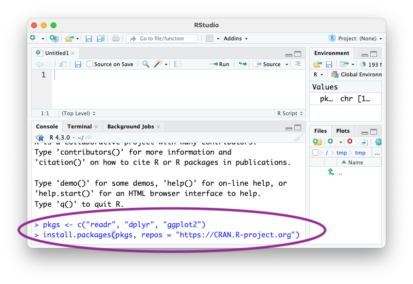

# BERD

<!-- badges: start -->
<!-- badges: end -->

This site provides course material for an 'Introduction to *R*'
workshop offered to University at Buffalo BERD scholars, April, 2024.

In preparation for the workshop, please

1. Follow [these instructions][install] to install *R* and *RStudio* Desktop

3. Install 'packages' we will use. Do this by copy / pasting the
   following commands into the *R* console in *RStudio*
   
   ``` r
   pkgs <- c("readr", "dplyr", "ggplot2")
   install.packages(pkgs, repos = "https://CRAN.R-project.org")
   ```

   

There are three one-hour sessions

- [Introduction to R][intro]
- [Data Input and Manipulation][io]
- [Statistical Analysis and Additional Visualization][vis]

[install]: https://posit.co/download/rstudio-desktop/
[intro]: https://mtmorgan.github.io/BERD/articles/a_introduction_to_r.html
[io]: https://mtmorgan.github.io/BERD/articles/b_data_io.html
[vis]: https://mtmorgan.github.io/BERD/articles/c_visualization.html

