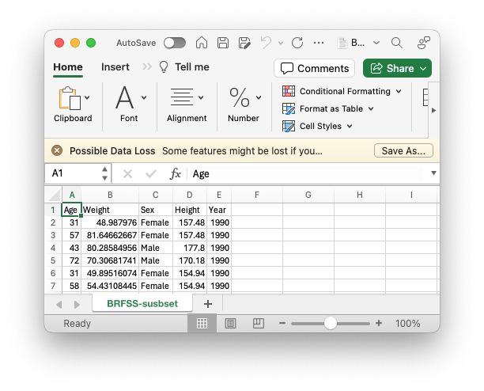
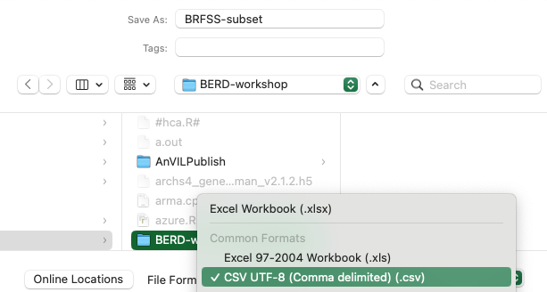

```{r, include = FALSE}
knitr::opts_chunk$set(
  collapse = TRUE,
  comment = "#>"
)
```

# Example data: BRFSS

We use data from the US Center for Disease Control's Behavioral Risk
Factor Surveillance System ([BRFSS][]) annual survey. Check out the
web page for a little more information. We are using a small subset of
this data, including a random sample of 20000 observations from each
of 1990 and 2010.

[BRFSS]: https://www.cdc.gov/brfss/

# Data input

## From Excel to CSV

Getting a dataset into *R* is a necessary and sometimes tedious
process. Often data starts as an Excel spreadsheet...



Note that this is a straight-forward sheet -- the first row provides a
column name. Each subsequent row corresponds to a single
observation. There are no mouse-over 'comments' or secondary tables
or... This simple structure is a good starting point for moving data
to *R*.

Our first step is to export the data from *Excel* to a 'CSV' file. We
do this because (a) CSV files are easily read into *R* and (b) many
other data sources can be transformed to CSV format. Chose the 'File'
menu and then 'Save'. On macOS I then chose to save the data as CSV
with a dialog box that looked like...



This procedure would create a file 'BRFSS-subset.csv' on our computer. 

We can't start with an Excel file, so instead download the data we
will work with using the following command. You might need to make
sure that the folder 'BRFSS-workshop' exists at the file system
location returned by `getwd()`.

```{r, eval = FALSE}
getwd()
url <- "https://raw.githubusercontent.com/mtmorgan/BERD/main/inst/extdata/BRFSS-subset.csv"
destination <- file.path("BRFSS-workshop", basename(url))
if (!file.exists(destination)) {
    dir.create("data")
    download.file(url, destination)
}
```

```{r, echo = FALSE}
destination <- system.file(package = "BERD", "extdata", "BRFSS-subset.csv")
```

## CSV to R

Read the data into *R* as a tibble using the [readr][] package.

```{r}
brfss <- readr::read_csv(destination)
brfss
```

# Explore the data using [dplyr][]

Attach [dplyr][] to our current *R* session.

```{r, message = FALSE}
library(dplyr)
```

Useful functions for data exploration

- `count()` -- count occurence of values in one or more columns
- `summarize()` -- more flexible summary of columns
- `group_by()` -- summarize or perform other operations by group

Functions for data manipulation

- `mutate()` -- update or add columns
- `filter()` -- remove rows based on column values
- `select()` -- remove, rearrange, or re-name columns

## `count()`

Count of observed values for one...

```{r}
brfss |>
    count(Year)
brfss |>
    count(Sex)
```

...or several columns

```{r}
brfss |>
    count(Year, Sex)
```

## `summarize()`

More flexible summary, e.g., number of observations `n()` or mean
values of columns, removing `NA`, `mean(, na.rm = TRUE)`.

```{r}
brfss |>
    summarize(
        n = n(),
        ave_age = mean(Age, na.rm = TRUE),
        ave_wt = mean(Weight, na.rm = TRUE),
        ave_ht = mean(Height, na.rm = TRUE)
    )
```

## `group_by()`

Often data sets contain groups that can be summarized separately,
e.g., calculating mean values by Year and Sex.

```{r}
brfss |>
    group_by(Year, Sex) |>
    summarize(
        n = n(),
        ave_age = mean(Age, na.rm = TRUE),
        ave_wt = mean(Weight, na.rm = TRUE),
        ave_ht = mean(Height, na.rm = TRUE)
    )
```    

## `mutate()`

`Year` and `Sex` should really be factors. Also, add a column
for log-10 transformed weight.

```{r}
brfss_clean <-
    brfss |>
    mutate(
        Year = factor(Year, levels = c("1990", "2010")),
        Sex = factor(Sex, levels = c("Female", "Male")),
        Log10Weight = log10(Weight)
    )
brfss_clean
```

## `filter()`

Create a subset of the data that includes only Male samples, ...

```{r}
brfss_male <-
    brfss_clean |>
    filter(Sex == "Male")
brfss_male
```

...or only Female samples from 2010.

```{r}
brfss_female_2010 <-
    brfss_clean |>
    filter(Sex == "Female", Year == "2010")
brfss_female_2010
```

## `select()`

Use `select()` to choose particular columns, or to re-order columns

```{r}
brfss_male |>
    select(Year, Age, Weight, Log10Weight, Height)
```

# Initial visualization

What is the relationship between Height and Weight in Female samples
from 2010?

```{r, fig.asp = 1}
plot(Weight ~ Height, brfss_female_2010)
```

With Weight on a log scale?

```{r, fig.asp = 1}
plot(Weight ~ Height, brfss_female_2010, log = "y")
## another way, but maybe the Y-axis scale is harder to interpret?
## plot(Log10Weight ~ Height, brfss_female_2010)
```

Does it look like Males differ in weight between 1990 and 2010,
plotted on a log scale?

```{r, fig.asp = 1}
brfss_male |>
    group_by(Year) |>
    summarize(
        n = n(),
        ave_wt = mean(Weight, na.rm = TRUE),
        ave_log10_wt = mean(Log10Weight, na.rm = TRUE)
    )
plot(Weight ~ Year, brfss_male, log = "y")
```

# Session information

```{r}
sessionInfo()
```

[dplyr]: https://CRAN.R-project.org/package=dplyr
[readr]: https://CRAN.R-project.org/package=readr
